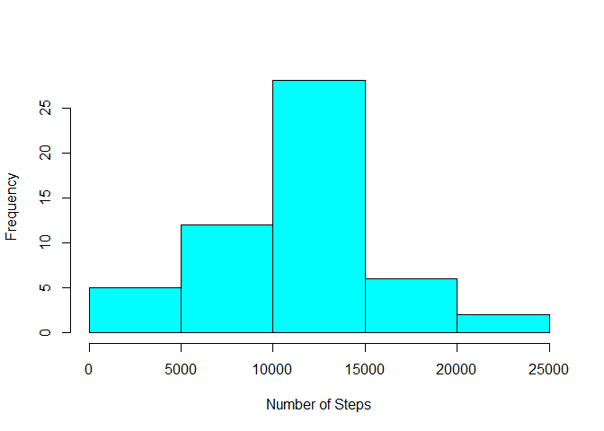

# Reproducible Research: Peer Assessment 1
Author: Hans Fleurkens

Load packages used for this assignment


```r
library("dplyr")
```

```
## Warning: package 'dplyr' was built under R version 3.2.3
```

```
## 
## Attaching package: 'dplyr'
## 
## The following objects are masked from 'package:stats':
## 
##     filter, lag
## 
## The following objects are masked from 'package:base':
## 
##     intersect, setdiff, setequal, union
```

```r
library("ggplot2")
```

```
## Warning: package 'ggplot2' was built under R version 3.2.5
```

## Loading and preprocessing the data

Load the dataset from the current directory:


```r
unzip("activity.zip")
df <- read.csv("activity.csv", colClasses=c("integer", "Date", "integer"))
```


## What is mean total number of steps taken per day?

Calculate the number of steps per day ignoring the missing values:


```r
adf <- filter(df, !is.na(steps))
steps_per_day <- summarize(group_by(adf, date), steps=sum(steps, na.rm=TRUE))
```

Make a histogram of the total number of steps taken each day:


```r
hist(steps_per_day$steps,xlab="Number of Steps", col="cyan", main="")
```

 

Calculate the mean and median number of steps taken each day:

```r
mean(steps_per_day$steps)
```

```
## [1] 10766.19
```

```r
median(steps_per_day$steps)
```

```
## [1] 10765
```

## What is the average daily activity pattern?

Make a time series plot of the 5-minute interval (x-axis) and the average number of steps taken, averaged across all days (y-axis)


```r
steps_per_interval <- summarize(group_by(adf, interval), steps=mean(steps, na.rm=TRUE))
plot(steps_per_interval$interval, steps_per_interval$steps, type="l",xlab="5-minute interval",
     ylab="Average number of steps", main="Average number of steps per 5-minute interval")
```

 

Which 5-minute interval, on average across all the days in the dataset, contains the maximum number of steps?


```r
steps_per_interval[which.max(steps_per_interval$steps), ]$interval
```

```
## [1] 835
```

## Imputing missing values
Calculate and report the total number of missing values in the dataset 

```r
sum(is.na(df$steps))
```

```
## [1] 2304
```

We fill the missing values of a 5-minute interval with the corresponding average value of the 5-minute interval of the other dates. These values were calculated in the previous step.

```r
for (i in 1:nrow(df)) {
  if (is.na(df[i, "steps"])) {
    df[i, "steps"] <- steps_per_interval[which(steps_per_interval$interval == df[i, "interval"]), "steps"]
  }
}
```
Recalculate the total numer of missing values

```r
sum(is.na(df$steps))
```

```
## [1] 0
```
Make a histogram of the total number of steps taken each day

```r
steps_per_day <- summarize(group_by(df, date), steps=sum(steps, na.rm=TRUE))
hist(steps_per_day$steps,xlab="Number of Steps", col="cyan", main="")
```

 

Calculate the mean and median number of steps taken each day:

```r
mean(steps_per_day$steps)
```

```
## [1] 10766.19
```

```r
median(steps_per_day$steps)
```

```
## [1] 10766.19
```
The mean is the same as the mean in the first part of the assignment. The median is different from the first part of the assignment. This is logical as the missing values for each interval have been replaced by the mean of that 5-minute interval for the dates with values.

## Are there differences in activity patterns between weekdays and weekends?
Create a new factor variable in the dataset with two levels - "weekday" and "weekend" indicating whether a given date is a weekday or weekend day. 

```r
df <- transform(df, daytype=weekdays(df$date) %in% c("Saturday", "Sunday"))
df <- mutate(df, daytype=factor(df$daytype, levels=c(FALSE, TRUE), 
                                   labels=c("weekday", "weekend")))
```

Make a panel plot containing a time series plot (i.e. type = "l") of the 5-minute interval (x-axis) and the average number of steps taken, averaged across all weekday days or weekend days (y-axis).

```r
steps_per_interval <- summarize(group_by(df, daytype, interval), steps=mean(steps, na.rm=TRUE))
qplot(interval,steps,data=steps_per_interval,geom="line",facets=daytype~.,
      xlab="5 minute interval", ylab="Number of steps")
```

 
